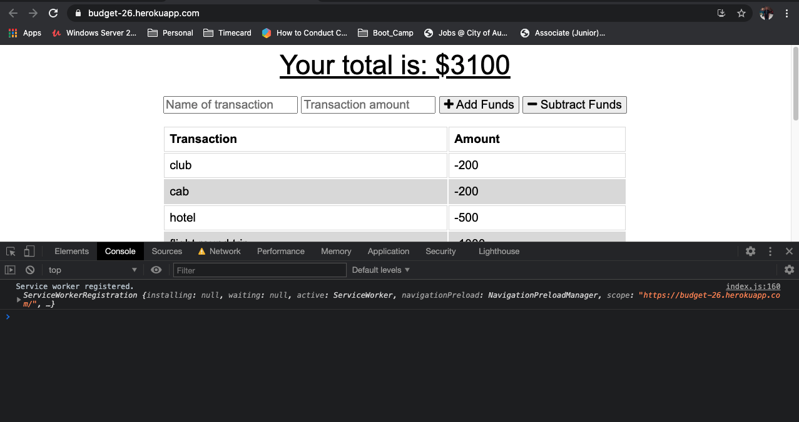
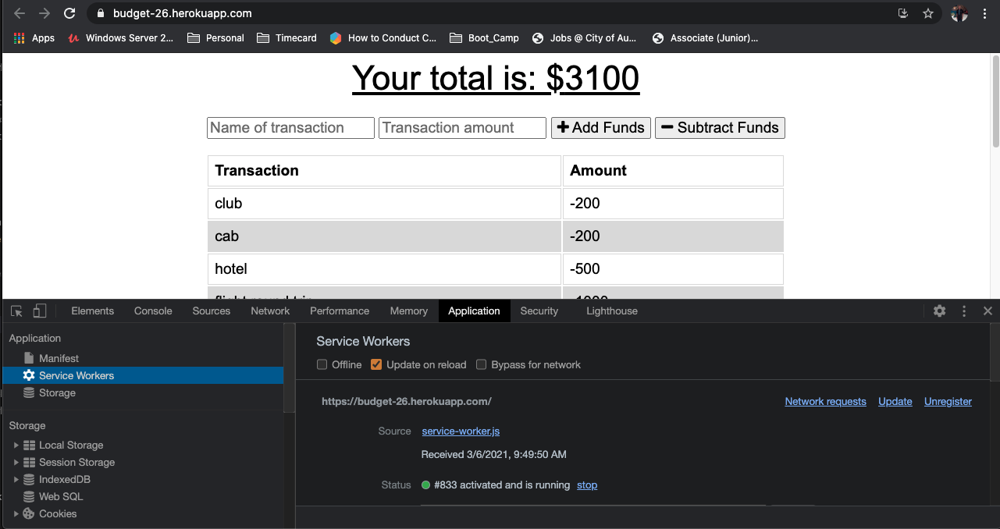
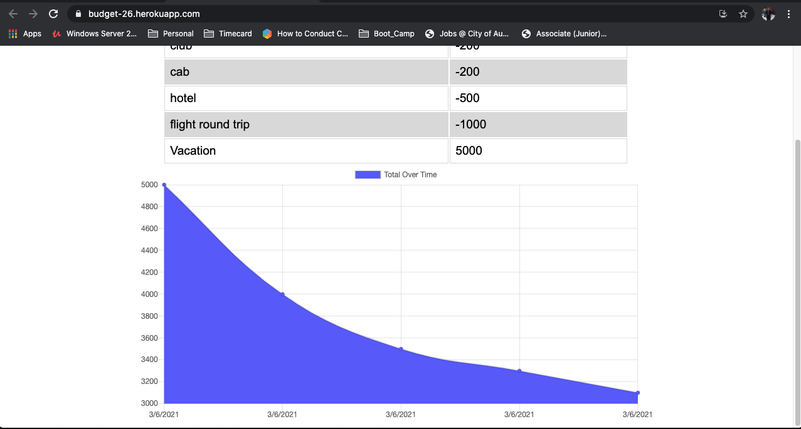

# Budget-Tracker

# Table of Contents  

* [Discription](#discription)
* [Screenshot](#screenshot)   
* [Contacts](#contacts)
* [Programming-Language](#programming-language)

## Discription   

This is a node application that allow users to add expenses and deposits to their budget with or without a connection. When entering transactions offline, they can populate the total when brought back offline. 

## Screenshot

 
## Contacts Info

Please reach out to me if you have any questions.

Email: afam262@gmail.com

Github Username: Afam-26

[Github link](https://github.com/Afam-26/Budget-Tracker.git) 

[Click here for my Portfolio](https://afam-26.github.io/)

## Programming-Language 
\`\`\`

    Node

    Express

    MongoDB 

    Mongoose Schema

    Heroku
\`\`\`